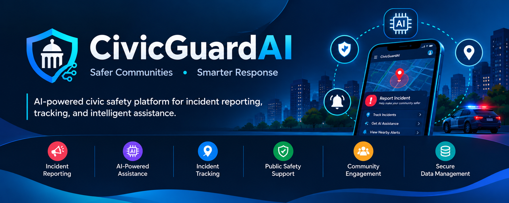

<p align="center">
  
</p>
# 🛡️ CivicGuardAI

### AI-Powered Civic Safety & Incident Management Platform

CivicGuardAI is a full-stack AI-powered civic safety platform designed to help users report, track, and manage civic incidents while providing intelligent assistance for faster and more organized responses.

## 🚀 Features

* 📍 **Incident Reporting** — Report civic and public-safety incidents.
* 🤖 **AI Assistance** — Use AI-powered analysis to assist with incident information.
* 📊 **Incident Tracking** — Track reported incidents and their status.
* 🗺️ **Location-Based Information** — Associate incidents with relevant locations.
* 🔔 **Safety Assistance** — Provide users with useful information during civic incidents.
* 👤 **User-Friendly Interface** — Simple and responsive interface for interacting with the platform.
* 🔐 **Data Management** — Store and manage incident-related information securely.
* ⚡ **Full-Stack Architecture** — Modern web application with frontend, backend services, and AI components.

## 🧠 AI Integration

CivicGuardAI integrates artificial intelligence into the civic-safety workflow to provide intelligent assistance when processing incident-related information.

The AI component can be extended for applications such as:

* Incident classification
* Incident prioritization
* Text analysis
* Intelligent recommendations
* Automated assistance
* Pattern identification

## 🏗️ Project Architecture

```text
CivicGuardAI/
│
├── app/              # Application pages and routes
├── components/       # Reusable UI components
├── lib/              # Utility functions and libraries
├── models/           # Data models
├── public/           # Static assets
├── python_service/   # Python-based AI/service components
├── services/         # Application services
├── types/            # TypeScript type definitions
│
├── .gitignore
├── AGENTS.md
├── CLAUDE.md
└── README.md
```
## 🎥 Project Demo

CivicGuardAI provides an AI-powered platform for reporting, tracking, and managing civic incidents through a simple and responsive web interface.

> 🚧 Live demo coming soon.

## 🛠️ Tech Stack

## 🛠️ Tech Stack

### Frontend
- Next.js
- React
- TypeScript
- Tailwind CSS

### Backend
- Node.js
- Next.js API Routes

### Database
- MongoDB

### AI / Machine Learning
- Python
- AI-powered incident analysis

### Tools & Services
- Git
- GitHub
- REST APIs

## ⚙️ Getting Started

### 1. Clone the repository

```bash
git clone https://github.com/kit2824bad176/CivicGuardAI.git
```

### 2. Navigate to the project

```bash
cd CivicGuardAI
```

### 3. Install dependencies

```bash
npm install
```

### 4. Configure environment variables

Create a `.env.local` file and add the environment variables required by the project.

Example:

```env
MONGODB_URI=your_mongodb_connection_string
```

Add any additional API keys or service configuration required by your implementation.

### 5. Run the development server

```bash
npm run dev
```

Open the application in your browser at:

```text
http://localhost:3000
```

## 📸 Screenshots

Screenshots of the CivicGuardAI application will be added here.

## 🔮 Future Enhancements

* Real-time incident notifications
* Advanced AI-based incident classification
* Incident severity prediction
* Interactive civic safety dashboard
* Real-time maps and location visualization
* Emergency response integration
* Mobile application
* Analytics and reporting dashboard
* Multilingual AI assistance

## 🎯 Project Goal

The goal of CivicGuardAI is to combine **web technologies, artificial intelligence, and civic-safety services** into a single platform that makes incident reporting and information management more accessible and organized.

## 👩‍💻 Developer

**Vanitha M**

AI & Data Science
KIT – Kalaignarkarunanidhi Institute of Technology, Coimbatore

---

⭐ If you find this project useful, consider giving the repository a star!
